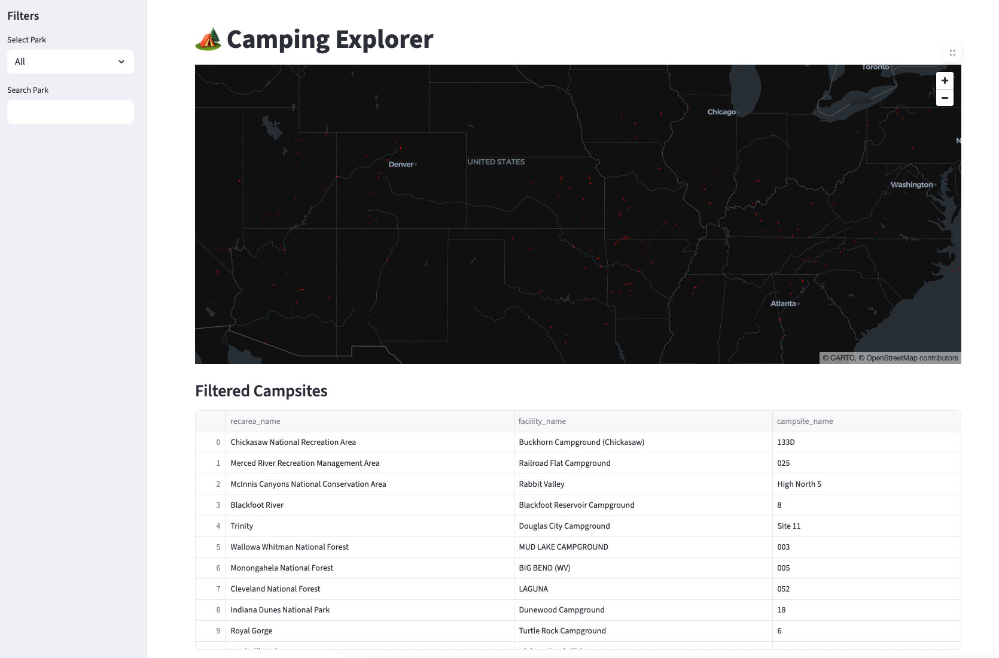

# 🏕 Outdoor Data Platform

An end-to-end data engineering project that builds a camping exploration platform using public recreation APIs.

The pipeline ingests campground data from the RIDB API, processes it through a layered data architecture, and provides an interactive dashboard to explore campsites across the United States.

---

## Architecture

RIDB API  
↓  
Bronze (Raw API data)  
↓  
Silver (Cleaned & normalized tables)  
↓  
DuckDB analytics  
↓  
Streamlit dashboard  

---

## Features

- API ingestion from Recreation.gov (RIDB)
- Bronze / Silver data pipeline
- Data transformation using Pandas
- DuckDB analytics layer
- Interactive campsite map using Streamlit

---

## Tech Stack

- Python  
- Pandas  
- DuckDB  
- Streamlit  
- Docker  

---

## Run Locally

### Install dependencies

```bash
pip install -r requirements.txt

### Run the Data Pipeline

```bash
python pipelines/camp_pipeline.py

### Launch the Dashboard

```bash
streamlit run dashboard/app.py

---
## Data Source

Recreation Information Database (RIDB)

https://ridb.recreation.gov/docs

## Dashboard Preview

<p align="center">
  
</p>
